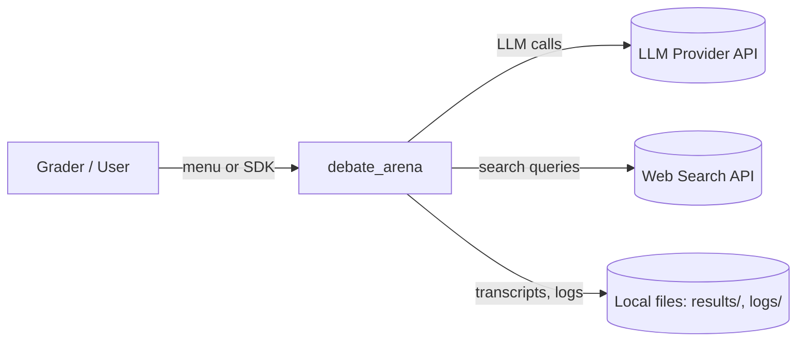
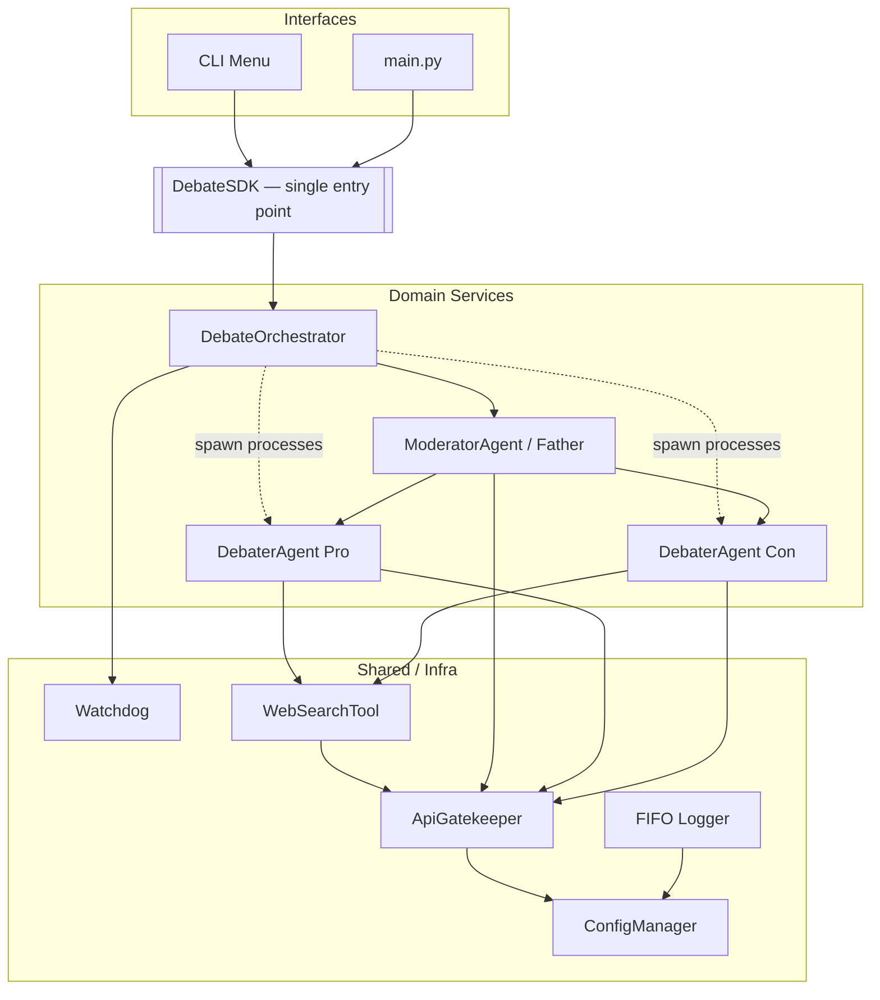
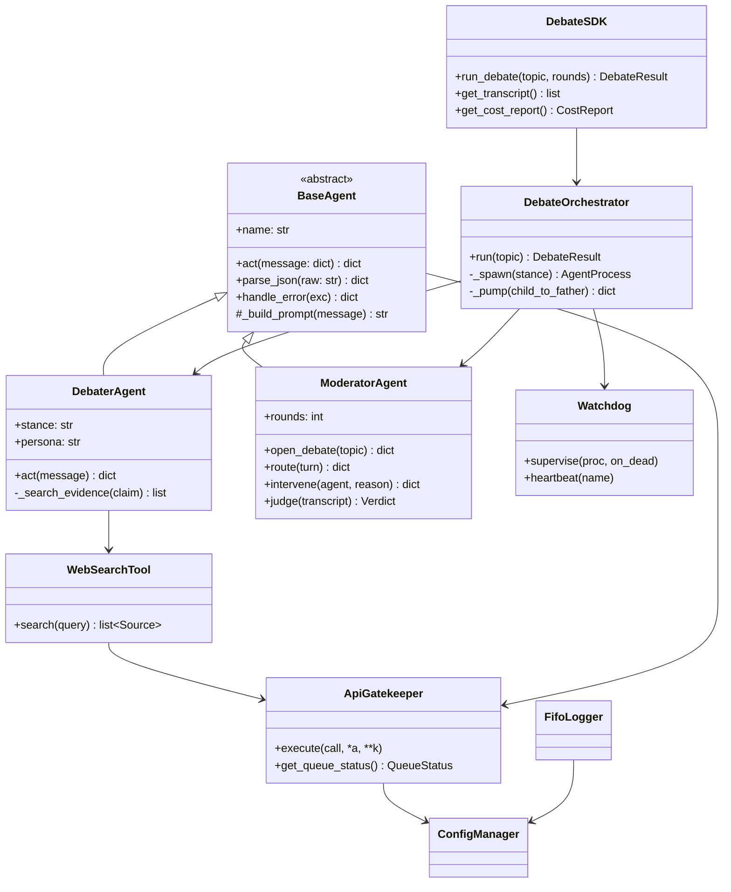

# Architecture & Implementation Plan (PLAN) — debate_arena

> Document version: **1.00** · Companion to [PRD.md](PRD.md)

This plan satisfies the official guidelines: SDK-based architecture (Guide §4),
OOP with no duplication (Guide §4.2/§16), config-driven gatekeeping (Guide §5),
FIFO logging (Guide §7.3), versioning (Guide §8.1), and real multiprocessing +
IPC (Guide §15).

---

## 1. C4 Model

### 1.1 Context (C1)


### 1.2 Container (C2)

> **Rule:** all business logic is reachable **only** through `DebateSDK`. The menu
> and `main.py` contain **no** orchestration logic — they delegate (Guide §4.1).

---

## 2. UML — class diagram (C3/Code)


### 2.1 Mixins (Guide §4.2) — single concern, independently testable
- `JsonContractMixin` — `parse_json` / `validate_schema` (used by all agents).
- `TokenAccountingMixin` — accumulates prompt/completion tokens per call.
These are factored out instead of duplicated; each is unit-tested in isolation.

---

## 3. Sequence — one ping + judgment
```mermaid
sequenceDiagram
  participant O as Orchestrator
  participant F as Father
  participant P as Pro (process)
  participant C as Con (process)
  participant W as Watchdog
  O->>W: supervise(Pro, Con)
  O->>F: open_debate(topic)
  F->>P: request_argument(context)
  P->>P: web_search + compose JSON
  P-->>F: argument{claim, sources, responding_to}
  F->>F: validate JSON + check citation + check capitulation
  alt capitulation detected
    F->>P: intervene(re-assert stance)
  end
  F->>C: request_rebuttal(Pro.argument)
  C-->>F: rebuttal{...responding_to: Pro.turn_id}
  Note over O,W: every call has a timeout; if a process hangs/dies,<br/>Watchdog kills & restarts it, debate continues
  loop until >=10 pings/side
    F->>P: ...
    F->>C: ...
  end
  F->>F: judge(transcript) -> winner + scores (no tie)
  F-->>O: Verdict
```

---

## 4. Data flow & state
1. `ConfigManager` loads `config/*.json` + `.env`; validates **versions** at startup.
2. `DebateSDK.run_debate()` → `DebateOrchestrator.run()`.
3. Orchestrator spawns **Pro** and **Con** as `multiprocessing.Process`,
   communicating via `multiprocessing.Queue` (request/response IPC).
4. Father pulls each child reply off the queue, validates JSON, enforces
   citation + `responding_to` + anti-capitulation, logs, then routes onward.
5. After N pings/side, Father judges → `Verdict`. Transcript + cost report saved
   to `results/`; rotating logs under the FIFO logger.

---

## 5. Architecture Decision Records (ADRs)

- **ADR-1: multiprocessing over asyncio/threads.** The assignment frames *agent =
  process* and the final phase as "Python managing three processes" (Ex §8.2/§8.6,
  Guide §15). Although the workload is I/O-bound, true processes give real IPC and
  let the Watchdog **kill & restart** a hung agent (impossible to force-kill a
  coroutine). *Trade-off:* higher overhead & serialization cost — accepted for
  correctness and rubric alignment.
- **ADR-2: SDK facade.** One `DebateSDK` is the sole entry point; UI/menu/tests
  all call it (Guide §4). *Trade-off:* slight indirection; gains testability +
  interface-independence.
- **ADR-3: Gatekeeper wraps every external call.** Central rate-limit/queue/retry/
  budget enforcement, config-driven (Guide §5). *Trade-off:* all calls must go
  through it (no shortcuts) — enforced by code review + a test asserting no direct
  provider calls.
- **ADR-4: Pydantic for the JSON contract.** Strict schema validation of every
  inter-agent message. *Trade-off:* a dependency; gains crisp edge-case tests.
- **ADR-5: Judge is topic-blind.** The judge prompt receives only the rules +
  transcript, never a "correct answer," scoring persuasion only (Ex §9).

---

## 6. API / contracts (summary; full schemas in per-mechanism PRDs)
- **Inter-agent message** (`responding_to`, `stance`, `claim`, `sources[]`,
  `reasoning`, `turn_id`) — see PRD_debate_orchestration.md.
- **Verdict** (`winner`, `scores{pro,con}`, `justification`) — see PRD_judge_scoring.md.
- **Gatekeeper** (`execute`, `get_queue_status`) — see PRD_gatekeeper.md.

---

## 7. Cross-cutting compliance map
| Guideline | Where implemented |
|-----------|-------------------|
| SDK layer (§4) | `src/debate_arena/sdk/sdk.py` |
| OOP / no dup (§4.2,§16) | `services/base_agent.py` + mixins in `shared/` |
| Gatekeeper (§5) | `shared/gatekeeper.py` + `config/rate_limits.json` |
| FIFO logging (§7.3) | `shared/logging_setup.py` + `config/logging_config.json` |
| No hardcoding (§7.2) | `shared/config.py`, `constants.py` |
| Versioning (§8.1) | `shared/version.py` + `"version"` in every JSON |
| Multiprocessing+IPC (§15) | `services/orchestrator.py` |
| ≤150 LOC, Ruff, ≥85% (§3.2,§6,§7.1) | `pyproject.toml` config + CI |
| Diagrams, Prompt Book (§2.2,§8.3) | this file + `docs/PROMPTS.md` |

---

## 8. Extensibility (Guide §12)
- New stance → register a persona in `config/setup.json` (no orchestrator change).
- New search provider → implement `WebSearchTool` interface, select via config.
- New model → `config/setup.json` model id; Gatekeeper rate-limits per service.
- Lifecycle hooks: `before_turn` / `after_turn` / `on_intervene` seams on the
  orchestrator for future plugins.
